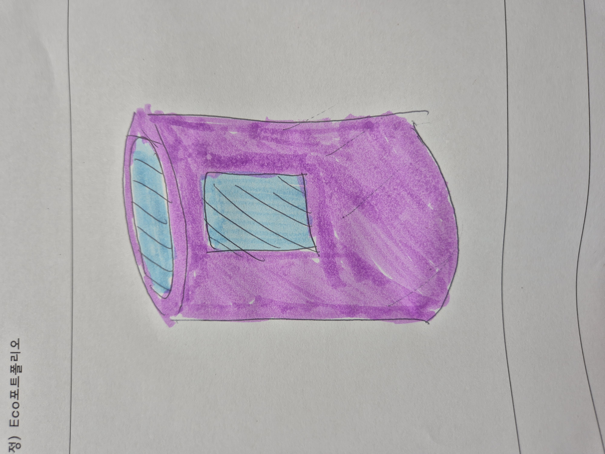
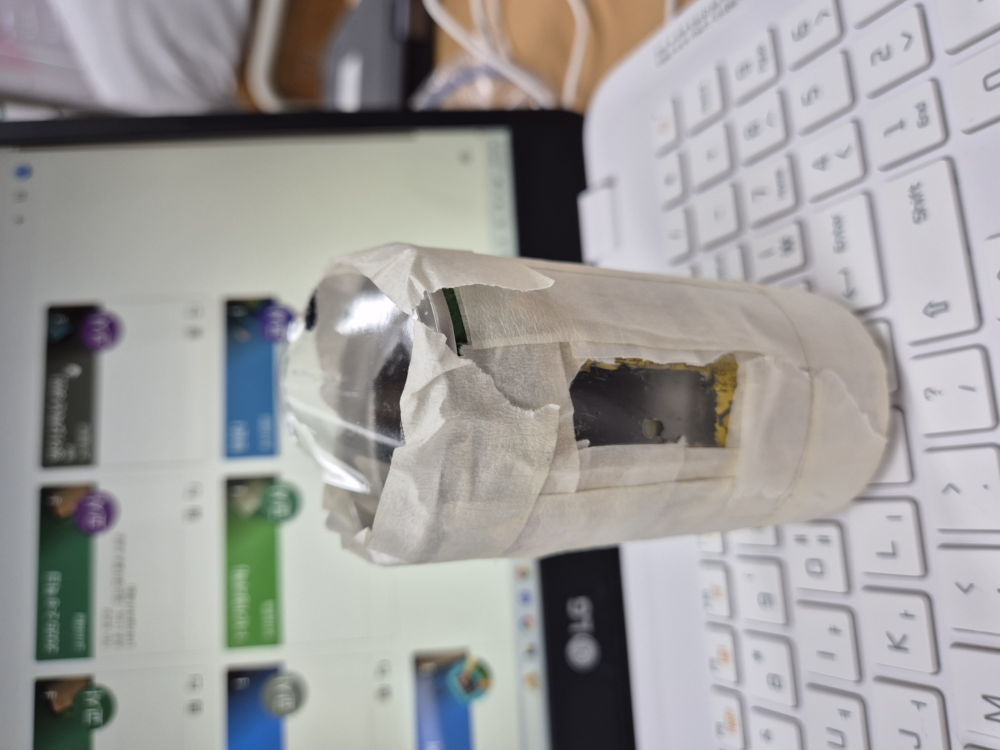

# 🌱 에코아트 프로젝트: [작품명]

## 📖 프로젝트 개요
- **제작자**: 김태윤
- **제작일**: 2025 7 16
- **소개**
> 평소에 캔이 많이 소비되서 쓰레기가 많이 배출되어 환경오염이 일어나는 점과 버려진 캔의 활용도가 많다는것을 강조하기 위해 만들기 쉬운 랜턴을 생각해 냈습니다

## 📦 사용 재료
- 망고 캔. 플라스틱 페트병

## 🔧 제작 과정

### 1단계: 아이디어 스케치

- 캔에 구멍을 뚫어 페트병으로 막아 안이 보아게 하고 윗 부분을 들어내서 양초를 넣을수 있게 만든다 페트병으로 윗 부분을 막아놓는다
- 별로 어렵지 않아서 다 완성될거 같다

### 2단계: 완성품

## 💭 제작 후기
### 잘된 점
- 페트병이 잘 잘려서 그나마 만들기 쉬웠다

### 아쉬운 점
- 캔은 자르고 구멍내기 힘들어서 많이 애먹었다

### 개선할 점
- 더 강한 공구로 캔을 자르면 훨씬 수월해지겠다

### 내가 이미 알고 있었던 것
- 버려지는 캔이 엄청 많아 작품을 만들기 충분하다

### 새롭게 배운게 된 것
- 아두이노로 통해 에코 아트에 대해 알게 되었고 재활용을 통한 작품들이 많다는것을 알게 되었다

### 더 알고 싶은 것
- 에코 아트를 통해 예술가들이 전하는 메세지들이 훗날 미래에서 어떻게 작용되는지 궁금하다

## 🌍 환경적 의미
- 단순히 랜턴효과 뿐만 아니라 캔의 활용도가 이렇게 많다는것을 강조하고 싶었다
- 누구나 쉽게 만들수 있어서 환경적으로나 비용적으로 부담이 적다
- 앞으로 쓰래기를 사용가능한 재활용품으로 만들어낼 계획을 세우겠다

## 📚 참고 자료
- 없음
- 없음

## 🏷️ 태그
#에코아트 #재활용 #환경보호 #DIY #창의활동#캔

---

> 이 프로젝트는 환경 보호와 창의적 사고를 위한 교육 목적으로 제작되었습니다.
